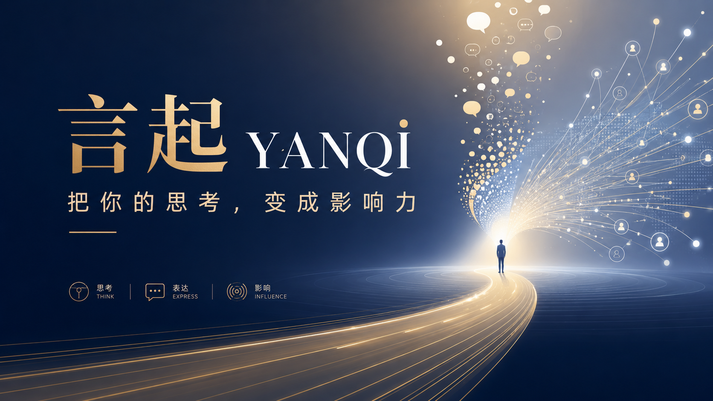

## 言起 YANQI — 把你的思考，变成影响力

> **好内容，不该埋在笔记里。**



一键将 Obsidian 笔记渲染为高质感品牌内容图的高级输出引擎。**The Engine of Influence.**

如果它能帮你少折腾一次排版，欢迎顺手点一下右上角 **Star**。Star 越多，我会优先补更多主题、骨架模板和 Agent 安装教程。

## 这是什么

言起（YANQI）不是普通的导出插件，而是你的「视觉终端」：把长博客、灵感速记、深度分析，一键渲染成适合小红书 / 公众号 / 即刻 / 微博传播的惊艳卡片。骨架、主题、封面、每张配图的裁剪——全部可调，所见即所得。

### 核心特性

- **12 套骨架模板** — 小红书、微博、公众号、报纸、语录、终端、GitHub 卡……一键换壳。
- **30 套主题 + 14 款字体** — 配色、字体、间距全部预设好，并带完整主题编辑器（可取色、可保存）。
- **5 种封面风格** — 首图单独换样式，封面与内容互不干扰。
- **光标跟随（双向联动）** — 编辑器光标移到哪，预览自动翻到对应卡片；点预览也能跳回原文。
- **图片插入优化** — 每张图都能拖动平移、缩放、**四角拖拽改大小**，按图记忆。
- **全览** — 一屏铺开整篇所有卡片，整体节奏一眼掌握。
- **批量导出** — 单页导出 + 一键导出全部页，保证整组图视觉一致。
- **零延迟实时预览** — 写下即所得，支持锁定，可自定义头像 / 昵称 / 页脚金句、半档字号微调。


> 该插件**配合阿东开源的 YANQI-note skills 使用更佳** —— 从「写内容」到「出视觉」，一条龙跑通。

## 骨架模板（12 套）

「骨架」只决定外壳——页眉、页脚、边框这一层，与主题（配色字体）、封面（首图样式）**三层独立、自由组合**。

**社媒卡片**

- **小红书笔记** — 小红书原生信息流观感
- **微博卡** — 微博长文卡片
- **公众号卡** — 公众号文章封面 / 卡片
- **备忘录** — iOS 备忘录质感的清爽笔记

**媒体 / 编辑风**

- **杂志刊头** — 杂志风刊头排版
- **报纸报头** — 复古报纸报头
- **语录卡** — 金句 / 摘抄 / 一句话观点

**开发者 / 极简**

- **终端窗口** — 代码 / 技术向的终端窗口
- **GitHub 卡** — 开发者气质的 GitHub 卡片
- **默认模板** — 通用百搭，不知道选啥就用它
- **极简无头** — 去掉页眉页脚，极致干净
- **纯署名** — 只留署名角标，画面最克制

|  |  |  |  |
| --- | --- | --- | --- |
| [](https://raw.githubusercontent.com/adongwanai/Awesome-Awesome-LLMs/main/20260617191445995.png) | [](https://raw.githubusercontent.com/adongwanai/Awesome-Awesome-LLMs/main/20260617191534981.png) | [](https://raw.githubusercontent.com/adongwanai/Awesome-Awesome-LLMs/main/20260617191556817.png) | [](https://raw.githubusercontent.com/adongwanai/Awesome-Awesome-LLMs/main/20260617191622426.png) |
| [](https://raw.githubusercontent.com/adongwanai/Awesome-Awesome-LLMs/main/20260617191815581.png) | [](https://raw.githubusercontent.com/adongwanai/Awesome-Awesome-LLMs/main/20260617191843533.png) | [](https://raw.githubusercontent.com/adongwanai/Awesome-Awesome-LLMs/main/20260617191933059.png) | [](https://raw.githubusercontent.com/adongwanai/Awesome-Awesome-LLMs/main/20260617192006258.png) |
| [](https://raw.githubusercontent.com/adongwanai/Awesome-Awesome-LLMs/main/20260617192045546.png) | [](https://raw.githubusercontent.com/adongwanai/Awesome-Awesome-LLMs/main/20260617192127864.png) | [](https://raw.githubusercontent.com/adongwanai/Awesome-Awesome-LLMs/main/20260617192206685.png) | [](https://raw.githubusercontent.com/adongwanai/Awesome-Awesome-LLMs/main/20260617192249562.png) |


## 安装

### 方式一：让 Claude / Codex 帮你安装（推荐）

把下面这段话复制给 Claude Code、Codex 或其他能操作本地文件的 Agent，让它全程帮你安装：

```text
请帮我把 GitHub 仓库 https://github.com/adongwanai/yanqi-obsidian 安装到我当前 Obsidian 仓库的插件目录里，并在 Obsidian 中启用它。

请你自动完成这些步骤：
1. 确认我当前使用的 Obsidian Vault 路径；如果有多个 Vault，先问我选哪一个。
2. 进入这个 Vault 的 `.obsidian/plugins/` 目录。
3. 克隆仓库到 `.obsidian/plugins/yanqi-obsidian/`。
4. 检查插件目录里是否存在 `manifest.json`、`main.js` 和 `styles.css`。
5. 帮我重启 Obsidian，或提示我完全退出后重新打开。
6. 引导我到 Obsidian 设置 → 第三方插件里启用「言起 YANQI」。
```

Agent 完成后，插件目录应该是：

```text
{vault}/.obsidian/plugins/yanqi-obsidian/
```

### 方式二：手动安装

如果不想让 Agent 操作，也可以手动把仓库放进 Obsidian 插件目录：

```bash
cd "{vault}/.obsidian/plugins"
git clone https://github.com/adongwanai/yanqi-obsidian.git yanqi-obsidian
```

或者在 GitHub 页面点击 **Code → Download ZIP**，解压后把整个 `yanqi-obsidian` 文件夹放到：

```text
{vault}/.obsidian/plugins/yanqi-obsidian/
```

重启 Obsidian 后启用插件即可。

`data.json` 是本地配置文件，不建议随 release 强制分发；首次启用后，Obsidian 会按你的设置自动生成。

安装成功后，也欢迎回到 GitHub 给项目点个 **Star**，我会根据 Star 和 Issue 反馈继续补主题、封面风格和使用教程。

## 使用

1. **魔法排版** — 设置里选标题级别（一级 `#` 或二级 `##`），用对应标题分割内容，每个标题自动生成一张卡片；正文 `---` 可再拆子页。
2. **沉浸式预览** — 按 `Cmd / Ctrl + P` 搜索 `打开言起 YANQI 预览`，或点侧边栏图片按钮开启画布。
3. **挑骨架 → 配主题 → 选封面** — 顶部选择器自由组合，右侧实时出图。
4. **微调** — 拖图片定位、四角改大小、调字号、点头像 / 昵称 / 页脚直接改字。
5. **一键出图** — 选「下载当前页」或「导出全部页」，直接发布。

## 主题画廊（30 套）

每套主题统一管理配色、字体、间距、行高，开箱即用；也能在主题编辑器里自定义（全局 / 背景 / 页眉 / 页脚 / 标题 / 段落 / 高亮 分组面板）。下面每套配 3 张展示图位（建议：封面页 / 内容页 / 列表页），按需替换。

### —— 通用 / 极简 ——

#### 默认主题

| [](https://raw.githubusercontent.com/adongwanai/Awesome-Awesome-LLMs/main/20260617200412932.png) | [](https://raw.githubusercontent.com/adongwanai/Awesome-Awesome-LLMs/main/20260617200527043.png) | [](https://raw.githubusercontent.com/adongwanai/Awesome-Awesome-LLMs/main/20260617200730049.png) |
| ------------------------------------------------------------------------------------------------------------------------------------------------------------------------------------------------- | ------------------------------------------------------------------------------------------------------------------------------------------------------------------------------------------------- | ------------------------------------------------------------------------------------------------------------------------------------------------------------------------------------------------- |

> 干净通用的默认配色，第一次用就选它，百搭不出错。

-----


#### 极简主题


| [](https://raw.githubusercontent.com/adongwanai/Awesome-Awesome-LLMs/main/20260617200817753.png) | [](https://raw.githubusercontent.com/adongwanai/Awesome-Awesome-LLMs/main/20260617202536202.png) | [](https://raw.githubusercontent.com/adongwanai/Awesome-Awesome-LLMs/main/20260617202641825.png) |
| ------------------------------------------------------------------------------------------------------------------------------------------------------------------------------------------------- | ------------------------------------------------------------------------------------------------------------------------------------------------------------------------------------------------- | ------------------------------------------------------------------------------------------------------------------------------------------------------------------------------------------------- |

> 大留白、细字重，信息克制到只剩内容本身。

----

#### 性冷淡极简


| [](https://raw.githubusercontent.com/adongwanai/Awesome-Awesome-LLMs/main/20260617203127989.png) | [](https://raw.githubusercontent.com/adongwanai/Awesome-Awesome-LLMs/main/20260617203035536.png) | [](https://raw.githubusercontent.com/adongwanai/Awesome-Awesome-LLMs/main/20260617203218624.png) |
| ------------------------------------------------------------------------------------------------------------------------------------------------------------------------------------------------- | ------------------------------------------------------------------------------------------------------------------------------------------------------------------------------------------------- | ------------------------------------------------------------------------------------------------------------------------------------------------------------------------------------------------- |

#### 莫兰迪灰调


| [](https://raw.githubusercontent.com/adongwanai/Awesome-Awesome-LLMs/main/20260617203436393.png) | [](https://raw.githubusercontent.com/adongwanai/Awesome-Awesome-LLMs/main/20260617203646234.png) | [](https://raw.githubusercontent.com/adongwanai/Awesome-Awesome-LLMs/main/20260617203757604.png) |
| ------------------------------------------------------------------------------------------------------------------------------------------------------------------------------------------------- | ------------------------------------------------------------------------------------------------------------------------------------------------------------------------------------------------- | ------------------------------------------------------------------------------------------------------------------------------------------------------------------------------------------------- |

> 低饱和灰阶色，温柔耐看的莫兰迪美学。

#### 瑞士红格


| [](https://raw.githubusercontent.com/adongwanai/Awesome-Awesome-LLMs/main/20260617204110501.png) | [](https://raw.githubusercontent.com/adongwanai/Awesome-Awesome-LLMs/main/20260617204301481.png) | [](https://raw.githubusercontent.com/adongwanai/Awesome-Awesome-LLMs/main/20260617204233496.png) |
| ------------------------------------------------------------------------------------------------------------------------------------------------------------------------------------------------- | ------------------------------------------------------------------------------------------------------------------------------------------------------------------------------------------------- | ------------------------------------------------------------------------------------------------------------------------------------------------------------------------------------------------- |

> 瑞士国际主义网格，红黑点缀，秩序与理性。

#### 学者羊皮


| [](https://raw.githubusercontent.com/adongwanai/Awesome-Awesome-LLMs/main/20260617204540182.png) | [](https://raw.githubusercontent.com/adongwanai/Awesome-Awesome-LLMs/main/20260617204617022.png) | [](https://raw.githubusercontent.com/adongwanai/Awesome-Awesome-LLMs/main/20260617204652020.png) |
| ------------------------------------------------------------------------------------------------------------------------------------------------------------------------------------------------- | ------------------------------------------------------------------------------------------------------------------------------------------------------------------------------------------------- | ------------------------------------------------------------------------------------------------------------------------------------------------------------------------------------------------- |

> 深底暖黄衬线，安静的学者羊皮卷气质。

### —— 信息流 / 社媒 ——

#### 阿东信息流主题

|  |  |  |
| --- | --- | --- |
| [](https://raw.githubusercontent.com/adongwanai/Awesome-Awesome-LLMs/main/20260617210906832.png) | [](https://raw.githubusercontent.com/adongwanai/Awesome-Awesome-LLMs/main/20260617210723409.png) | [](https://raw.githubusercontent.com/adongwanai/Awesome-Awesome-LLMs/main/20260617210925375.png) |


> 紧凑高信息密度，专为信息流长文优化的默认主力。

#### 便签备忘录

|  |  |  |
| --- | --- | --- |
| [](https://raw.githubusercontent.com/adongwanai/Awesome-Awesome-LLMs/main/20260617211012569.png) | [](https://raw.githubusercontent.com/adongwanai/Awesome-Awesome-LLMs/main/20260617211045190.png) | [](https://raw.githubusercontent.com/adongwanai/Awesome-Awesome-LLMs/main/20260617211110323.png) |

> iOS 备忘录质感，随手记的清爽便签风。

#### 奶油手账

|  |  |  |
| --- | --- | --- |
| [](https://raw.githubusercontent.com/adongwanai/Awesome-Awesome-LLMs/main/20260617211212426.png) | [](https://raw.githubusercontent.com/adongwanai/Awesome-Awesome-LLMs/main/20260617211309712.png) | [](https://raw.githubusercontent.com/adongwanai/Awesome-Awesome-LLMs/main/20260617211359976.png) |

> 奶油底色与手账感，柔软治愈的记录风。

#### 樱花飞舞

待补充真实截图。

> 粉白渐变，柔软浪漫的春日气息。

#### 暖阳文艺

待补充真实截图。

> 暖橘奶白，午后阳光般的温柔文艺调。

### —— 暗色 / 科技 ——

#### 优雅暗色

待补充真实截图。

> 深色底配柔和高光，沉稳有质感的夜读感。

#### 赛博朋克

待补充真实截图。

> 霓虹紫青撞色，故障感与未来都市气息。

#### 暗夜终端

待补充真实截图。

> 深色终端配等宽字，开发者的极客夜色。

#### 科技蓝

待补充真实截图。

> 清爽信号蓝，干净利落的科技产品感。

#### 金属科技

待补充真实截图。

> 冷灰金属反光，硬朗的工业科技感。

#### 高压工作室

待补充真实截图。

> 黑底电光黄，高电压的设计工作室能量。

#### 星空梦境

待补充真实截图。

> 深紫夜空点缀星光，梦幻而辽阔。

### —— 杂志 / 文艺 ——

#### 电子杂志暖刊

待补充真实截图。

> 暖色刊物排版，像一本精致的电子杂志。

#### 大字报黑金

待补充真实截图。

> 黑底金字超大标题，宣言式的强冲击力。

#### 牛皮纸

待补充真实截图。

> 牛皮纸底纹，怀旧手作的复古质感。

#### 沙丘

待补充真实截图。

> 沙色暖调，辽阔粗粝的大地气息。

#### 中世暖橘

待补充真实截图。

> 暗哑绿配灼橘，中世纪现代的木质暖调。

#### 悦灵雅棕

待补充真实截图。

> 雅致棕调，温润耐看的轻奢气质。

### —— 东方 / 自然 ——

#### 新中式水墨

待补充真实截图。

> 留白与墨韵，含蓄雅致的新中式气质。

#### 墨水经典

待补充真实截图。

> 黑白水墨书卷气，沉稳通用的文人调。

#### 靛蓝瓷

待补充真实截图。

> 靛蓝如瓷，清雅而有东方器物感。

#### 森林墨

待补充真实截图。

> 墨绿沉色，安静内敛的林间书写感。

#### 森林清晨

待补充真实截图。

> 草木绿与雾白，清新自然的呼吸感。

#### 深海之境

待补充真实截图。

> 深蓝层叠，安静幽邃的海洋色温。

## 字体（14 款）

默认字体、宋体、黑体、楷体、雅黑、苹方、冬青黑体、思源黑体、思源宋体、霞鹜文楷、得意黑、华文细黑、等宽代码、Helvetica。

## 封面风格（5 种）

首图可独立于内容页选择样式：

- **经典居中** — 标题居中，稳重通用
- **大字报** — 超大字号，强冲击力
- **杂志** — 杂志刊头式排版
- **编号** — 带序号的系列感封面
- **极简** — 留白最大化


| [](https://raw.githubusercontent.com/adongwanai/Awesome-Awesome-LLMs/main/20260617185926401.png) | [](https://raw.githubusercontent.com/adongwanai/Awesome-Awesome-LLMs/main/20260617190008094.png) | [](https://raw.githubusercontent.com/adongwanai/Awesome-Awesome-LLMs/main/20260617190057572.png) |
| ------------------------------------------------------------------------------------------------------------------------------------------------------------------------------------------------- | ------------------------------------------------------------------------------------------------------------------------------------------------------------------------------------------------- | ------------------------------------------------------------------------------------------------------------------------------------------------------------------------------------------------- |
| [](https://raw.githubusercontent.com/adongwanai/Awesome-Awesome-LLMs/main/20260617190223826.png) | [](https://raw.githubusercontent.com/adongwanai/Awesome-Awesome-LLMs/main/20260617190254389.png) |                                                                                                                                                                                                   |

## 编辑体验

#### 🎯 光标跟随（双向联动）
解锁状态下，编辑器光标移到哪一节，预览自动翻到对应卡片；点预览卡片也能把编辑器跳回原文。


#### ✂️ 图片插入优化
每张图都被包进可调裁剪框：拖图片本体 = 平移，右上角 +/− = 缩放，**四角拖拽 = 改大小**，↺ = 一键复位。所有调整按每张图单独记忆，重开仍在。


#### 🗂 全览
点「全览」一屏铺开整篇所有卡片，检查整体节奏与配色一致性。


#### 📥 导出
「下载当前页」导出单张；「导出全部页」一键批量生成整组连贯图片。


## 🙏 致谢 & 推荐搭配

言起把笔记变成「好看的图」，下面两位大佬的开源 Skill 能把内容变成「好看的演示」，强烈推荐一起用：

- **歸藏（@op7418）｜杂志风网页 PPT Skill** — <https://github.com/op7418/guizang-ppt-skill>
- **张 Zara（@zarazhangrui）｜前端 Slides Skill** — <https://github.com/zarazhangrui/frontend-slides>


## 开源与署名

言起 YANQI 基于开源项目 **[Note to RED](https://github.com/Yeban8090/note-to-red)**（作者 Yeban8090，MIT 许可证）二次开发，并完整保留原作者版权声明。感谢 Yeban8090 的开源工作。

为了防止无署名搬运、换皮发布和商业化复刻，言起 YANQI 的新增部分（包括但不限于品牌命名、交互增强、骨架模板、主题体系、封面风格、文档与后续新增代码）采用 **YANQI Source-Available License**：

- 允许个人学习、研究、非商业自用，以及提交 issue / PR。
- 二次修改或分发必须保留 **言起 YANQI / 阿东玩AI** 与 **Note to RED / Yeban8090** 的署名，并在 README、关于页或发布说明中明确标注来源链接。
- 禁止删除署名后换皮发布，或以高度相似的名称、界面、模板、主题、文档进行搬运式复刻。
- 未经作者书面授权，禁止将本项目或其衍生版本上架插件市场、出售、SaaS 化，或作为商业产品的一部分分发。

如果你只是自用、学习或一起改进这个项目，非常欢迎；这些限制主要针对无署名抄袭和换皮商业化。

## License

原始 Note to RED 部分继续遵循其 MIT 许可证；言起 YANQI 新增部分版权所有 © 2026 阿东玩AI，并遵循上面的 YANQI Source-Available License。

---

> 很多人有判断，有内容。但真正能被看见、被传播的，往往是最会表达的内容。
